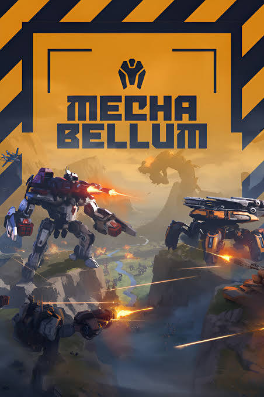
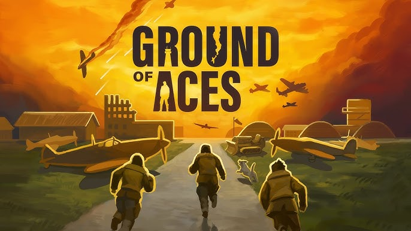

# Games resource

Base endpoint:
```
{base_url}/games
```

Contains information about video games in the GameDepot database.

## Games in the database

| | | | | |
|:---:|:---:|:---:|:---:|:---:|
|  |  |  |  |  |
| Battlefield 6 | Mechabellum | Cities Skylines II | Manor Lords | Ground of Aces |

## Resource properties

Sample `games` resource:
```json
{
  "title": "Battlefield 6",
  "release_date": "10-Oct-2025",
  "category": "first person shooter",
  "price": "$69.99",
  "publisher": "Electronic Arts",
  "image": "https://upload.wikimedia.org/wikipedia/commons/thumb/8/8e/Battlefield_1_logo.png/220px-Battlefield_1_logo.png",
  "id": 1
}
```

| Property name | Type | Description |
| ------------- | ----------- | ----------- |
| `title` | string | The name of the game |
| `release_date` | string | When the game was released |
| `category` | string | The game's genre (e.g., "first person shooter," "city builder") |
| `price` | string | Current retail price |
| `publisher` | string | Company that published the game |
| `image` | string | URL to the game's cover image |
| `id` | number | Unique identifier for the game |

## Operations

The `games` resource supports these operations:

### READ (GET)

* [Get all games](games-get-all-games.md)
* [Get game by ID](games-get-game-by-id.md)

### CREATE (POST)

* [Create a game](games-create-game.md)

### UPDATE (PUT)

* [Update a game](games-update-game.md)

### DELETE

* [Delete a game](games-delete-game.md)